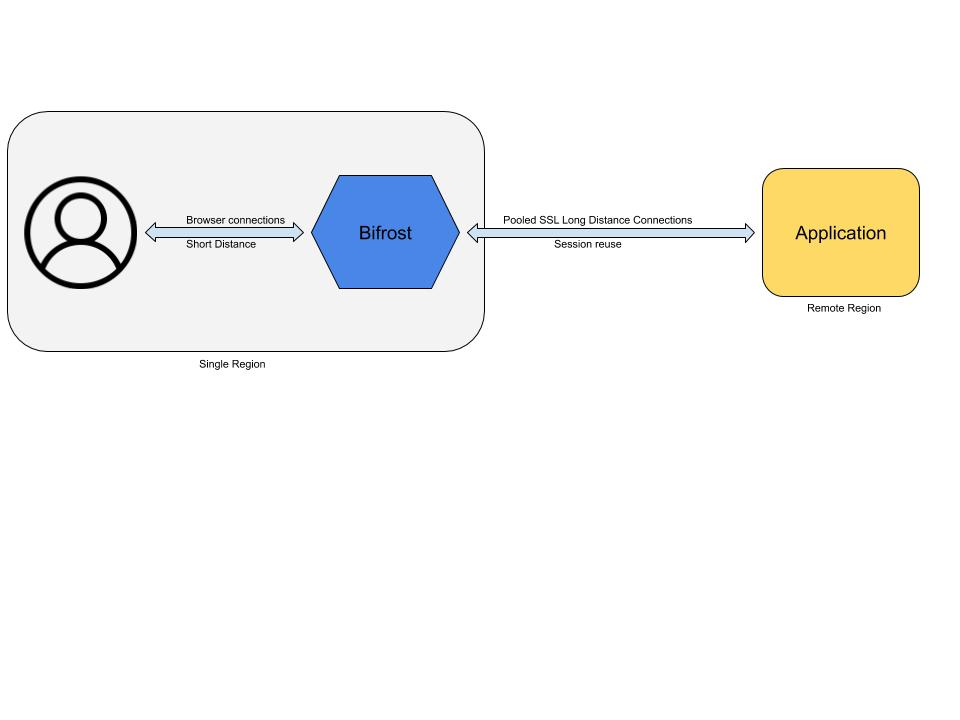

# Introduction

Bifrost is a cloud-native web acceleration tool, it can deployed in any public cloud in a region closer to user to front and accelerate a remote web service

Global web applications have users all around the world, but are usually deployed in a single region due to stack related dependencies like databases. Bifrost can be deployed as an intermediate hop for such global applications in a public cloud closest to user and improve user experience

Bifrost terminates connections from user in a region closest to the user and routes the connection to the end applicaton reusing pre-established pooled connection to the application

# Further Reading

